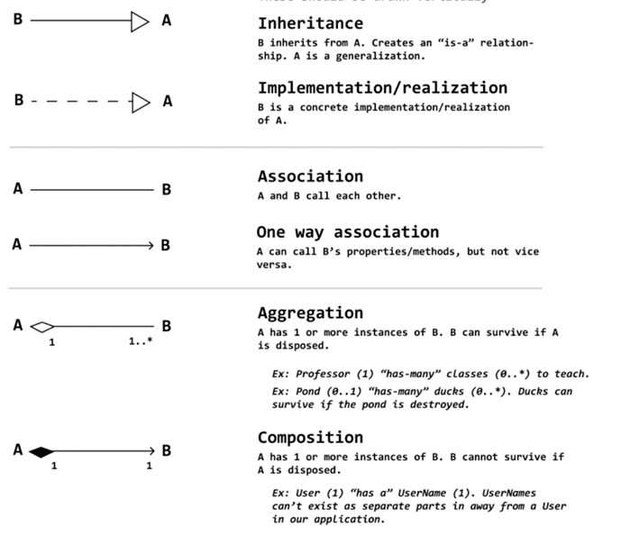

#### Theory

###### Microservices

> [!WARNING]  
> Example callout

### Code

#### UML Guide



#### Infrastructure - Context

```cs
public class InnolabContext : DbContext  
{  
    public InnolabContext(DbContextOptions opt) : base(opt) {    }  
    public DbSet<InnolabUser> Users => Set<InnolabUser>();  
    public DbSet<Reservation> Reservations => Set<Reservation>();  
    protected override void OnModelCreating(ModelBuilder modelBuilder)  
    { modelBuilder.Entity<InnolabUser>().HasIndex(u => u.Email).IsUnique(); }
    
    public async Task Seed(){
        var users = new List<InnolabUser> { new InnolabUser("admin", "admin") };
        Users.AddRange(users);
        await SaveChangesAsync();
    }
}   
```

#### Infrastructure - Repository

```cs
public class Repository<TEntity, TKey> where TEntity : class, IEntity<TKey> where TKey : struct 
{ 
    protected readonly InnoLabContext _db; 
    public IQueryable<TEntity> Set => _db.Set<TEntity>(); 
    public Repository(InnoLabContext db) => _db = db; 
    public virtual (bool success, string message) InsertOne(TEntity entity) 
    { 
        _db.Set<TEntity>().Add(entity); 
        // _db.Set<TEntity>().Remove(entity);  <- DELETE 
        // _db.Set<TEntity>().Update(entity);  <- UPDATE 
        try 
        { 
            _db.SaveChanges(); 
        } 
        catch (DbUpdateException e) 
        { 
            return (false, e.InnerException?.Message ?? e.Message); 
        } 
        return (true, string.Empty);    
    } 

    public (bool success, string message, TEntity? entity) GetById(TKey id) 
    { 
        try 
        { 
            var entity = _db.Set<TEntity>().Local.FirstOrDefault(e => e.Id.Equals(id)) ?? _db.Set<TEntity>().Find(id); 
            return entity == null ? (true, $"No entity with ID {id} found.", null) : (true, string.Empty, entity); 
        } 
        catch (DbUpdateException e) 
        { 
            return (false, e.InnerException?.Message ?? e.Message, null); 
        }     
    } 
}
```

#### Domain Model

```cs
public interface IEntity<TKey> where TKey : struct 
{ TKey Id { get; } }  // you can also just use int and remove TKey stuff if u get errors
```

```cs
[Index(nameof(Email), IsUnique = true)] // unique constraint on email
public class MyClass: IEntity<int> {  // inherit from IEntity
    #pragma warning disable CS8618
    protected DefaultConstructor(){}

    [Key]
    [DatabaseGenerated(DatabaseGeneratedOption.None)]
    public int AutoIncKeyWithoutNamingConvention { get; private set; }
    [Required]  // not null
    [StringLength(25)] // max string length
    public string Email { get; set; }
}
```

Fluent api equivalent + **enum conversion**:

```cs
modelBuilder.Entity<InnolabUser>().HasIndex(u => u.Email).IsUnique();  
modelBuilder.Entity<Reservation>().Property(r => r.State).HasConversion<string>();
modelBuilder.Entity<Reservation>().Property(r => r.State).HasConversion<string>().HasMaxLength(25);
```

Custom enum conversion:

```cs
modelBuilder.Entity<Reservation>().Property(r => r.State)
.HasConversion(
    // Convert enum to uppercase string when saving to the database
    v => v.ToString().ToUpper(),  
    // Convert from string to enum when reading from the database
    v => (ReservationStates)Enum.Parse(typeof(ReservationStates), v) 
);
```

Value objects:

```cs
public record Address(
    string Street, 
    string City, 
    string ZipCode
);
---
modelBuilder.Entity<Order>().OwnsOne(p => p.ShippingAddress);
modelBuilder.Entity<User>().OwnsMany(p => p.Address)
```

Enum:

```cs
public enum ReservationStates { Pending, Approved, Denied }
```

##### One-to-one 1:1

Required

```cs
// Principal (parent)
public class MyClassA
{
    public int Id { get; set; }
    public MyClassB? MyClassB { get; set; } // Reference navigation to dependent
}
// Dependent (child)
public class MyClassB
{
    public int Id { get; set; }
    public int MyClassAId { get; set; } // Required foreign key property
    public MyClassA MyClassA { get; set; } = null!; // Required reference navigation to principal
}
```
A type is usually the dependent type if it cannot logically exist without the other type. in natural parent/child relationship,  the child is  the dependent type.

Explicitly setting up a **1:1** relation between class `MyClassA` and `MyClassB` in ModelBuilder. Add .IsRequired() if its a required 1:1 relation.
```cs
modelBuilder
    .Entity<MyClassA>()
    .HasOne<MyClassB>(a => a.B)
    .WithOne(b => b.A)
    .HasForeignKey<MyClassB>(b => b.AId);
```

##### One-to-many **1:N**

Required

```cs
// Principal (parent)
public class MyClassA
{
    public int Id { get; set; }
    public ICollection<MyClassB> MyClassBs { get; } = new List<MyClassB>(); // Collection navigation containing dependents
}
// Dependent (child)
public class MyClassB
{
    public int Id { get; set; }
    public int MyClassAId { get; set; } // Required foreign key property
    public MyClassA MyClassA { get; set; } = null!; // Required reference navigation to principal
}
```
Explicitly etting up an **1:N** relation between class `MyClassA` and `MyClassB` using ModelBuilder. Add .IsRequired() if its a required 1:N relation.
```cs
modelBuilder
    .Entity<MyClassA>()
    .HasMany<MyClassB>(a => a.MyClassBs)
    .WithOne(b => b.MyClassA)
    .HasForeignKey(b => b.MyClassAId);
```

##### Many-to-many M:N

```cs
public class MyClassA
{
    public int Id { get; set; }
    public List<MyClassB> MyClassBs { get; } = [];
    public List<MyClassCs> MyClassCs { get; } = [];
}
public class MyClassB
{
    public int Id { get; set; }
    public List<MyClassA> MyClassAs { get; } = [];
    public List<MyClassC> MyClassCs { get; } = [];
}
// join table class
public class MyClassC
{
    public int MyClassAId { get; set; }
    public int MyClassBId { get; set; }
    public MyClassA MyClassA { get; set; } = null!;
    public MyClassB MyClassB { get; set; } = null!;
}
```
Explicitly setting up an **M:N** relation between class `MyClassA` and `MyClassB` with `MyClassC` in the middle using ModelBuilder.
```cs
modelBuilder
    .Entity<MyClassA>()
    .HasMany<MyClassB>(a => a.MyClassBs)
    .WithMany(b => b.MyClassAs)
    .UsingEntity<MyClassC>();
```

Another way to do **M:N**:

```cs
class Item: IEntity
{
    // ...
    protected List<Tag> _tags = [];
    public IReadOnlyCollection<Tag> Tags => _tags;
}
class Tag: IEntity
{
    // ...
    public ICollection<Item> Items;;
}
```

Discriminator column for **inheritance** (Table per hierarchy)

```cs
modelBuilder.Entity<Human>()
    .HasDiscriminator<string>("type")
    .HasValue<Teacher>("teacher")
    .HasValue<Student>("student");
```

Table per type:

```cs
modelBuilder.Entity<Teacher>().ToTable("Teachers");
modelBuilder.Entity<Student>().ToTable("Students");
```

Tests:

```cs
public class DatabaseTest : IDisposable  
{  
    private readonly SqliteConnection _connection;  
    protected readonly InnolabContext _db;  
  
    public DatabaseTest()  
    {      
        _connection = new SqliteConnection("DataSource=:memory:");  
        _connection.Open();  
        var options = new DbContextOptionsBuilder<InnolabContext>()  
            .UseSqlite(_connection)  
            .UseLazyLoadingProxies()  
            .LogTo(message => Debug.WriteLine(message), Microsoft.Extensions.Logging.LogLevel.Information)  
            .EnableSensitiveDataLogging()  
            .Options;  
        _db = new InnolabContext(options);  
        _db.Database.EnsureCreated();  
    }  
    public void Dispose()  
    {   
	    db.Dispose();  
        _connection.Dispose();  
    }}
```

Faker + Assertions / example test:

```cs
public class MyContextTests: DatabaseTest
{
    [Fact]
    public void CreateDatabaseTest() {
        Assert.True(true);  // DatabaseTest constructor is called without exception
    }}
---
public class UserTests : DatabaseTest
{
    private readonly UserRepository _userRepository;
    public static User GenerateUser()
    {
        var faker = new Faker<User>()
            .CustomInstantiator(f => new User(
                username: f.Internet.UserName(),
                initialPassword: f.Internet.Password()
            )
        );
        return faker.Generate();
    }
    [Fact]
    public void AddUserSuccessTest()
    {
        var user = GenerateUser();
        var (success, _) = _userRepository.InsertOne(user);
        Assert.True(success);
        Assert.Equal(1, _db.Users.Count());
        // common asserts: Assert.Empty, Assert.Single, Assert.NotEqual, Assert.Contains, Assert.DoesNotContain
    }
```

#### NSUbstitute

```cs
[Fact]
public async Task GetIngredients_ReturnsOkResultWithCorrectList()
{
    // Mock the IRepository
    var repository = Substitute.For<IRepository<Ingredient>>();
    repository.GetAllAsync().Returns(new List<Ingredient> { new Ingredient("Vegan")
    });
    var controller = new MyController(repository);
    // Convert the Result to a usable object
    var result1 = await controller.GetIngredients();
    var result2 = (OkObjectResult) result1;
    // Assert the correct statements
    Assert.Equal(result2.StatusCode, 200);
    Assert.Equal(1, result2.Value as List<Ingredient>).Count());
}
```

#### Linq

when doing queries that access other class properties do this to include all of their information:

```cs
_dbc.DividerBoxes.Include(a => a.DividerBoxLocations).ThenInclude(a =>
a.StorageRoomNavigation);
```

SingleOrDefault: Returns a single specific element or default if none or more than one element exists.

```cs
var student = context.Students.SingleOrDefault(s => s.StudentId == 1);
```

Count: Returns the total number of elements in a sequence.

```cs
int count = context.Students.Count();
```

Any: Checks if any elements in a sequence satisfy a condition.

```cs
bool exists = context.Students.Any(s => s.Grade > 3);
```

Sum: Computes the sum of a sequence of numeric values.

```cs
int totalScore = context.Students.Sum(s => s.Score);
```

Max and Min: Finds the maximum or minimum value in a sequence.

```cs
var maxScore = context.Students.Max(s => s.Score);
var minScore = context.Students.Min(s => s.Score);
```

ToList: Converts an IQueryable or IEnumerable to a List.

```cs
var studentList = context.Students.ToList();
```

First / FirstOrDefault: Returns the first element of a sequence, or a default value if no element is found.

```cs
var student = context.Students.FirstOrDefault(s => s.Name == "John");
```

OrderBy / OrderByDescending: Sorts the elements of a sequence in ascending or descending order.

```cs
var sortedStudents = context.Students.OrderBy(s => s.Name);
```

GroupBy: Groups the elements of a sequence.

```cs
var groupedByStandard = context.Students.GroupBy(s => s.StandardId);
```

#### Web API

Basic structure of a controller:

```cs
    // Necessary attributes
    [Route("api/[controller]")]
    [ApiController]
    public class MyController : ControllerBase
    {
    // Inject the necessary dependencies
    private readonly MyContext _context;
    public MyController(MyContext context)
    {
        _context = context;
    }
    // Define a route
    [HttpGet("{id:int}")]
    public IActionResult GetSingle(int id)
    {
        return Ok(null!);
    }
}
```

Command / DTO object (it's the same):

```cs
public record CreateClothingCmd(
    ClothingType Type,
    [StringLength(64, MinimumLength = 1, ErrorMessage = "Name must be between 1 and 64 characters")]
    string Name,
    [StringLength(256, ErrorMessage = "Image URL must be less than 256 characters")]
    string? ImageUrl,
    Guid OwnerGuid,
    Guid[] Tags
) : IValidatableObject
{
    // example *custom validation*. ! if not needed, remove IValidatableObject !
    public IEnumerable<ValidationResult> Validate(ValidationContext validationContext)
    {
        var db = validationContext.GetRequiredService<DesignerContext>();
        if (!db.Users.Any(u => u.Guid == OwnerGuid))
            yield return new ValidationResult("Owner not found", new[] {nameof(OwnerGuid)});
    }
}
```

#### Misc

Concatenate two strings: `string Combined => $"{Brand} {Model}";`

#### Services Layer Exceptions

- ArgumentNullException(nameof(entity)): Throws if entity is null. Ensures required parameters are not null.
- InvalidOperationException(): Throws if the current state of the object does not support the requested operation.
- ApplicationException(): Generic exception for application-specific errors. Less preferred; use more specific
  exceptions.

#### Controller Layer Responses

- Ok(): Returns HTTP 200 OK status. Indicates success, can return data.
- OkObjectResult(data): Similar to Ok(), but specifically returns data with HTTP 200 OK.
- BadRequest(): Returns HTTP 400 Bad Request status. Indicates client-side error.
- NotFound(): Returns HTTP 404 Not Found status. Indicates the requested resource does not exist.
- StatusCode(StatusCodes.Status500InternalServerError): Returns HTTP 500 Internal Server Error. Used for general
  server-side errors.
